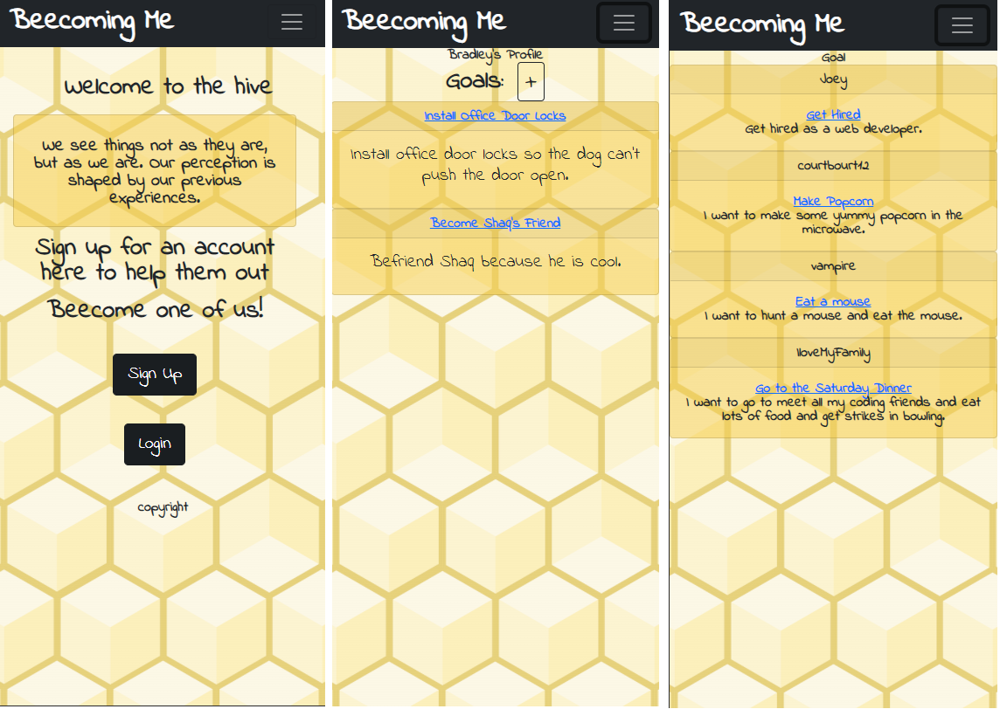

# Beecoming Me

## Description

Beecoming Me is a social media web application. It allows users to create and track goals in a mobile-first designed platform. The main feature of this web application is the user can add their friends/family to their goals so they have support to help them accomplish their goal.

## Table of Content

- [User Story](#user-story)
- [Acceptance Criteria](#acceptance-criteria)
- [URL Link to GitHub Repository](#url-link-to-github-repository)
- [URL link to deploy in Heroku](#url-link-to-deploy-in-heroku)
- [Mock-Up Image](#mock-up-image)
- [Contribution](#contribution)

## User Story

```
AS A parent who records data about my child
I WANT an easy way to input data and view information
SO THAT I can gain insight into their patterns and better meet their needs
```

## Acceptance Criteria

```
GIVEN a mobile first responsive MVC site
WHEN I visit the site for the first time
THEN I am taken to a login home page with a motivational caption briefly capturing the target audience’s attention along with a sign up/log in section
WHEN I log in or sign up
THEN I am taken to an informational page for how to structure goals, the biggest reasons for goal failures, and has a button option to create a goal
WHEN I click on the button to create a goal
THEN I am prompted with choosing a specific item for the goal (like go to the gym, or clean the house),  an end time (time constraint) for the goal, and some kind of measurable quantity for your goal (examples: if you want to go to the gym more, the goal shouldn’t just be “go to the gym,” it should be “go to the gym for x min, x days per week). Once all parameters are in, the user can click a “save goal” button
WHEN I press the save goal button
THEN I am asked the question, “Is this goal realistically attainable in your current situation” with a yes or no button
WHEN I press yes,
THEN the goal is created
WHEN I press no
THEN the user is taken back through the goal creating process with the prompt “create a new goal for what you need to accomplish to make this goal achievable”
WHEN all the goals are created
THEN the user is presented with an organized chart of goals with the first one they need to accomplish shown more prominently than the rest
WHEN I click on the first goal
THEN I can log my progress, share the goal with friends, and get feedback as well as work on this goal as a group if desired
```

## URL Link to GitHub Repository

https://github.com/courtbourt12/beecomingme

## URL link to deploy in Heroku

http://beecomingme.com/

## Mock-Up Image



## Contribution

- Courtney L. [github profile](https://github.com/courtbourt12)
- Bradley K. [github profile](https://github.com/brouiller)
- Preksha G. [github profile](https://github.com/Pgandhi21)
- Morgan R. [github profile](https://github.com/MJGRiley)
- Joey P. [github profile](https://github.com/JoeyGitsIt)
